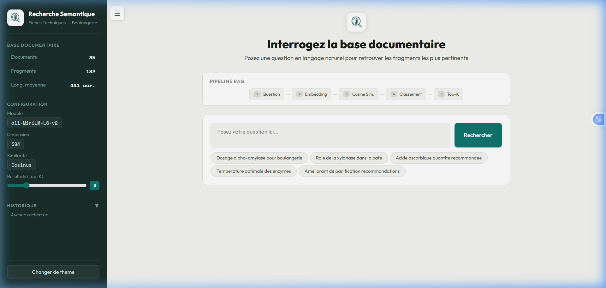
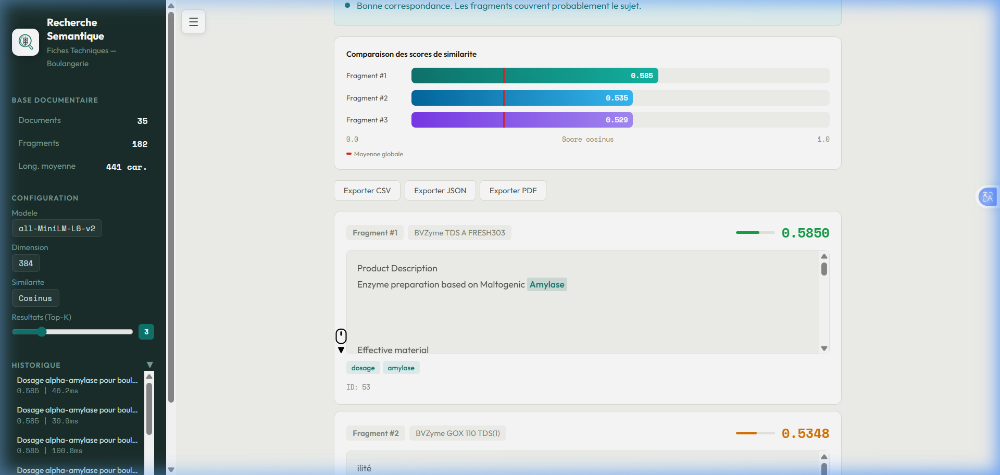
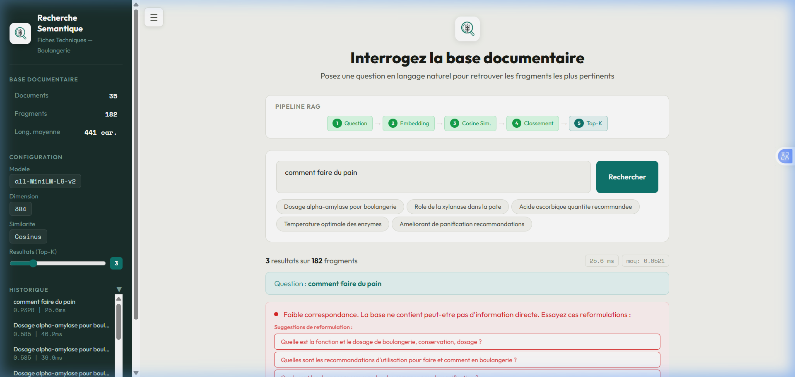
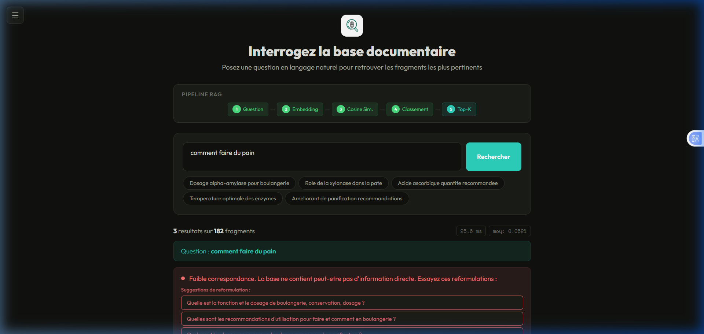

# 🔍 RAG — Recherche Sémantique sur Fiches Techniques

> Prototype de recherche sémantique (RAG) pour interroger une base de fiches techniques d'enzymes en boulangerie/pâtisserie, en langage naturel.

## 🎬 Vidéo Démo

**[▶ Voir la démo du prototype](static/demo_prototype.webp)**

La vidéo montre : recherche sémantique, graphique de scores, export PDF/CSV/JSON, suggestions de reformulation, sidebar rétractable, historique pliable, et dark mode.


---

## 📋 Architecture

| Composant | Technologie |
|---|---|
| Modèle d'embedding | `all-MiniLM-L6-v2` (Sentence Transformers) |
| Dimension | 384 |
| Similarité | Cosinus |
| Base de données | PostgreSQL |
| Backend | Flask (Python) |
| Frontend | HTML / CSS / JavaScript |

## ⚡ Pipeline RAG

```
Question → Embedding → Cosine Similarity → Classement → Top-K
```

## 🚀 Installation & Lancement

### 1. Cloner le projet
```bash
git clone https://github.com/KodsLamouchi322/rag-fiches-techniques.git
cd rag-fiches-techniques
```

### 2. Installer les dépendances
```bash
pip install -r requirements.txt
```

### 3. Configurer la base de données
```bash
# Créer le fichier .env
cp .env.example .env
# Modifier les valeurs dans .env avec vos identifiants PostgreSQL
```

```bash
# Créer la table dans PostgreSQL
psql -U postgres -d enzymes_db -f setup_database.sql
```

### 4. Indexer les documents PDF
```bash
python 01_ingestion.py
```

### 5. Lancer le serveur
```bash
python app.py
# → http://localhost:5000
```

## 🎯 Fonctionnalités

| # | Fonctionnalité | Description |
|---|---|---|
| 1 | 🔍 **Recherche sémantique** | Question en langage naturel → fragments les plus pertinents |
| 2 | 💡 **Reformulations intelligentes** | Suggestions automatiques quand les résultats sont faibles |
| 3 | 📊 **Graphique de scores** | Comparaison visuelle avec ligne de moyenne globale |
| 4 | 📄 **Export PDF / CSV / JSON** | Résultats téléchargeables en 3 formats |
| 5 | 🌙 **Dark / Light mode** | Toggle avec préférence persistante |
| 6 | ⚡ **Cache d'embeddings** | 2ème recherche quasi-instantanée |
| 7 | 🔄 **Pipeline animé** | Visualisation des 5 étapes en temps réel |
| 8 | 🖍️ **Surlignage mots-clés** | Termes pertinents colorés dans les résultats |
| 9 | 📜 **Historique interactif** | Recherches précédentes cliquables |
| 10 | 📈 **Analyse qualitative** | 4 niveaux de pertinence (Excellent → Faible) |

## 📁 Structure du projet

```
├── app.py                  # Backend Flask + logique RAG
├── 01_ingestion.py         # Indexation des PDFs → PostgreSQL
├── 02_recherche.py         # Script de recherche CLI
├── setup_database.sql      # Schéma de la base de données
├── requirements.txt        # Dépendances Python
├── .env.example            # Template de configuration
├── templates/
│   └── index.html          # Interface web complète
├── static/
│   └── img/
│       └── logo.png        # Logo du prototype
├── *.pdf                   # 35 fiches techniques (source)
└── RESULTATS_ATTENDUS.md   # Document des résultats attendus
```

## 📸 Captures d'écran

### Page d'accueil


### Résultats de recherche


### Graphique + Cartes de résultats


### Suggestions de reformulation


### Mode sombre


---

**Développé dans le cadre d'un challenge universitaire — 2026**
