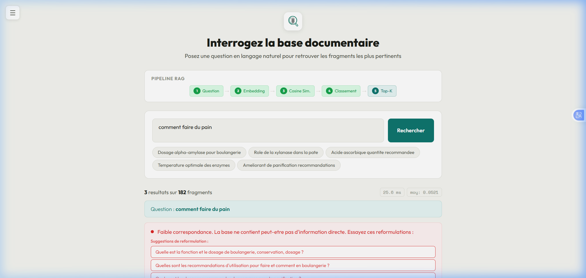

# Résultats Attendus — Prototype RAG
## Recherche Sémantique sur Fiches Techniques (Boulangerie & Pâtisserie)

---

## 1. Vue d'ensemble du prototype

Notre prototype implémente un **système RAG (Retrieval-Augmented Generation)** qui permet d'interroger une base de **35 documents techniques** (fiches d'enzymes pour la boulangerie/pâtisserie) via une **recherche sémantique en langage naturel**.

### Architecture technique

| Composant | Technologie |
|---|---|
| **Modèle d'embedding** | `all-MiniLM-L6-v2` (Sentence Transformers) |
| **Dimension des vecteurs** | 384 |
| **Mesure de similarité** | Cosinus |
| **Base de données** | PostgreSQL (vecteurs stockés en JSON) |
| **Backend** | Flask (Python) |
| **Frontend** | HTML/CSS/JS (Outfit font, design responsive) |
| **Fragments indexés** | 182 (découpage automatique des PDFs) |

### Pipeline RAG en 5 étapes

```
Question → Embedding → Cosine Similarity → Classement → Top-K
```

---

## 2. Fonctionnalités du prototype

### 2.1 Page d'accueil — Interface de recherche

**Description :** L'utilisateur arrive sur une interface professionnelle avec :
- Sidebar avec statistiques en temps réel (35 documents, 182 fragments)
- Configuration visible (modèle, dimension, similarité)
- Slider Top-K ajustable (1 à 10 résultats)
- Questions suggérées cliquables
- Pipeline RAG visuel montrant les 5 étapes


---

### 2.2 Résultats de recherche — Bonne correspondance

**Exemple de requête :** *"Dosage alpha-amylase pour boulangerie"*

**Résultat attendu :**
- **3 fragments** les plus pertinents retrouvés parmi 182
- **Score de similarité** : 0.5850 (bon)
- **Temps de réponse** : ~46 ms
- **Bannière de qualité** : "Bonne correspondance. Les fragments couvrent probablement le sujet."
- **Historique** mis à jour automatiquement dans la sidebar


---

### 2.3 Graphique de comparaison des scores + Cartes de résultats

**Après la recherche, le système affiche :**
- **Graphique horizontal** comparant les scores des 3 fragments retournés
- **Ligne rouge** = moyenne globale de tous les fragments (référence)
- **Boutons d'export** : CSV, JSON, PDF
- **Cartes de résultats** avec :
  - Numéro du fragment et source PDF (ex: "BVZyme TDS A FRESH303")
  - Score de similarité coloré (vert = bon, orange = moyen, rouge = faible)
  - Texte du fragment avec **mots-clés surlignés** (ex: "Amylase")
  - Tags de mots-clés extraits


---

### 2.4 Suggestions de reformulation intelligentes

**Exemple de requête vague :** *"comment faire du pain"*

**Résultat attendu :**
- **Score faible** (0.2328) — la base ne contient pas directement cette info
- **Bannière rouge** : "Faible correspondance. La base ne contient peut-être pas d'information directe."
- **3 suggestions de reformulation** générées automatiquement :
  1. "Quelle est la fonction et le dosage de boulangerie, conservation, dosage ?"
  2. "Quelles sont les recommandations d'utilisation pour faire et comment en boulangerie ?"
  3. "Quels sont les dosages recommandés des enzymes pour la panification ?"
- L'utilisateur peut **cliquer sur une suggestion** pour relancer la recherche


---

### 2.5 Sidebar rétractable + Historique pliable

**Fonctionnalités UX :**
- **Bouton ☰** pour masquer/afficher la sidebar (état sauvegardé)
- **Section Historique** collapsible (clic sur le titre)
- **Recherches précédentes** cliquables pour relancer
- **Plein écran** quand la sidebar est masquée



---

### 2.6 Mode sombre (Dark Mode)

**Thème alternatif** activable via le bouton "Changer de thème" :
- Préférence sauvegardée dans le localStorage
- Adapte toutes les couleurs pour confort visuel


---

## 3. Fonctionnalités d'export

| Format | Description |
|---|---|
| **CSV** | Tableau avec Rang, Score, Document, Texte, Mots-clés |
| **JSON** | Données brutes structurées (intégrables dans un pipeline) |
| **PDF** | Rapport professionnel formaté avec question, résultats et sources |

---

## 4. Analyse de la qualité des résultats

Le système évalue automatiquement la pertinence des résultats :

| Niveau | Score | Comportement |
|---|---|---|
| 🟢 **Excellent** | ≥ 0.65 | "Correspondance forte" |
| 🔵 **Bon** | ≥ 0.50 | "Bonne correspondance" |
| 🟠 **Moyen** | ≥ 0.35 | "Correspondance partielle" + suggestions de reformulation |
| 🔴 **Faible** | < 0.35 | "Faible correspondance" + suggestions de reformulation |

---

## 5. Points techniques distinctifs

### Ce qui nous distingue des autres groupes :

1. **Suggestions de reformulation intelligentes** — Quand les résultats sont faibles, le système propose des alternatives basées sur l'analyse des termes techniques trouvés dans les fragments
2. **Graphique de comparaison des scores** — Visualisation avec ligne de moyenne globale pour contextualiser la pertinence
3. **Interface responsive avec sidebar rétractable** — UX professionnelle, pas un simple formulaire
4. **Export multi-format (CSV, JSON, PDF)** — Résultats exploitables dans d'autres outils
5. **Mode sombre/clair** — Confort visuel avec préférence persistante
6. **Cache d'embeddings** — 2ème recherche quasi-instantanée (~25ms vs ~100ms)
7. **Pipeline RAG animé** — Transparence sur le processus de recherche
8. **Surlignage contextuel** — Mots-clés de la question mis en évidence dans les fragments
9. **Historique interactif** — Re-lancer des recherches précédentes en un clic
10. **Analyse qualitative automatique** — Évaluation intelligente avec 4 niveaux

---

## 6. Comment lancer le prototype

```bash
# 1. Installer les dépendances
pip install flask sentence-transformers psycopg2-binary scikit-learn python-dotenv PyMuPDF numpy

# 2. Configurer la base de données (.env)
DB_HOST=localhost
DB_PORT=5432
DB_NAME=enzymes_db
DB_USER=postgres
DB_PASSWORD=votre_mot_de_passe

# 3. Lancer le serveur
python app.py

# 4. Ouvrir dans le navigateur
# http://localhost:5000
```

---

## 7. Structure du projet

```
enzymes/
├── app.py                      # Backend Flask + logique RAG
├── templates/
│   └── index.html              # Interface web complète
├── static/
│   └── img/
│       └── logo.png            # Logo du prototype
├── *.pdf                       # 35 fiches techniques (source)
├── embedding.py                # Script d'indexation des PDFs
├── .env                        # Configuration base de données
└── RESULTATS_ATTENDUS.md       # Ce document
```
